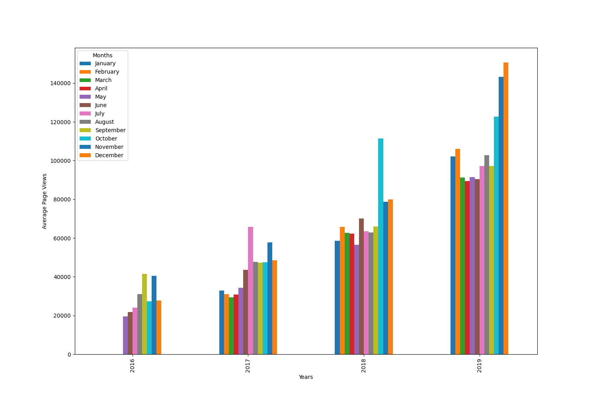
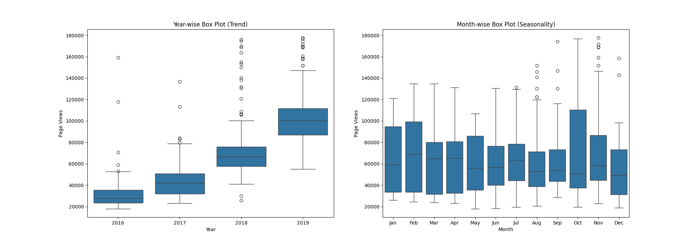

# 📊 Page View Time Series Visualizer

---

## 📁 Dataset

- `fcc-forum-pageviews.csv`
- Columns:
  - `date` (string): Date of measurement
  - `value` (int): Number of forum page views

---

## 📌 Tasks Performed

1. **Imported and cleaned data**  
   Removed the top and bottom 2.5% of data to filter out outliers.
   
2. **Line Plot**  
   Shows daily page views over time.
   
3. **Bar Plot**  
   Shows average monthly page views grouped by year.
   
4. **Box Plots**  
   Year-wise and Month-wise distribution of page views to identify trends and seasonality.

---

## 📈 Visualizations

### 🔹 Line Plot
Shows daily forum page views from 2016–2019:

---

### 🔸 Bar Plot
Displays average monthly views for each year:

---

### 🔹 Box Plots
Year-wise and Month-wise distribution:

---

